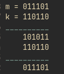

# ***Crypto - Maciej Burak***

## Pierwsze zajęcia [07.10.2021]

### IoT - definicja ze strony oracle.com
The Internet of Things (IoT) describes the network of physical objects—“things”—that are embedded with sensors, software, and other technologies for the purpose of connecting and exchanging data with other devices and systems over the internet. These devices range from ordinary household objects to sophisticated industrial tools.

### IIoT - definicja ze strony oracle.com
Industrial IoT (IIoT) refers to the application of IoT technology in industrial settings, especially with respect to instrumentation and control of sensors and devices that engage cloud technologies.

### "Things":
- sensors
- actuators
- devices
- HMI
- (...)
    1. computing capabilities
    2. unique digital identity/digital adress
    3. can connect and communicate to each other
    4. connected to physical objects

### Zastosowania:
- Smart manufacturing
- Connected asets and preventive and predictive maintenance
- Smart power grids
- Smart cities
- Connected logistics
- Smart digital supply chains

### "Piramida" przemysłowego IT:
- ERP - Enterprise Resource Planning
- MES - Manugacturing Execution System
- SCADA Network - Supervisiom Control And Data Acquisition
- PLC PS - Programmable Logic Control // Process Station
    1. Sieć wewnętrzna kończy się na PLC PS
- Sensors & Actuators
- Rozwinięcie inf. nt. poziomów: (Purdue Reference Model ANSI/ISA-99)
    1. L0 - proces fizyczny
    2. L1 - inteligentne urządzenia
    3. L2 idk
    4. L3 - zarządzanie syst.
    5. L4..

### Rozwój, przemysł 3.0 => 4.0 ("Time Sensitive Networking" - White Paper, Hirschmann 2019)
- Bloki: sieciowy, czujniki, chmura

### Zakres materiału:
- Wprow. do problematyki bezp. syst. przemysł.
- wprowadzenie kryptografii
    1. podst. mechanizmy, ich połączenie w protokołach złożonych i zastosowanie w konkretnych aplikacjach
- mechanizmy bezpieczeństwa SO
- bezpieczeństwo sieci

- William Stallings, Cryptography and Network Security

### Bezpieczeństwo danych (secutiry)
- Security - zewnętrzny cznnik próbuje coś zepsuć
- Safety - zakłada wynik przypadkowych zjawisk
- poufność (confidentiality) - utajnienie iformacji i zasobów
- autentyczność - indentyfikacja i pewność pochodzenia źródła
- nienaruszalność/integralność
- dostępność
- security != safety

### Polityka bezpieczeństwa  (secutiryt policy)
- klasufikacja zasobów (jawne, poufne, tajne..)
- roole (administrator, dział personalny, księegowość)
- reguły dostępu
- regulacje, procedury, środki (ochrona haseł, procedury przyznawania dostępu, wykorzystywane technologie)

## Drugie zajęcia [14.10.2021]

### Poziomy bezpieczeństwa

Dimensions of sata security:

- Physical
- Personnel
- Procedural
- Technical

### Bezpieczeństwo fizyczne

(NA ZALICZENIU!!)
poziomy bezpieczeństwa

- Infrastruktura - zabezpieczenia fizyczne, przeciwpożarowe, klimatyzacja...
- Kontrola dostępu
- monitoring
- ochrona

### Bezpieczeństwo osobowe

- Rekrutacja - referencje, zaświadczenie o niekaralności, background checks (kontakt z poprzednim pracodawcą)
- Ocena okresowa/awans zawodowy
- procedury dyscyplinarne
- certyfikaty/poświadczenia bezpieczeństwa (sektor publiczny)

### Bezpieczeństwo proceduralne

- Instrukcje bezpieczeństwa/ochrony danych (Information security policy)
- Procedury przyznawania i kontroli dostępu
- Procedury kontroli i audytu
- Ustawa o ochronie informacji niejawnych (sektor publiczny)

### Bezpieczeństwo techniczne

Dostępność:

- infrastruktura, wydajność/przepustowość
- replikacja, backup, archiwizacja
(...)

### Techniki kryptograficzne

- **kryptografia**  -
- **kryptoanaliza** -
- **kryptologia** -

Kryptogram - tekst zaszyfrowany (ang. cipher text)

Uwierzytelnienie - sprawdzenie czyjejś osobowości

Autoryzacja - następuje po uwierzytelnieniu, przyznanie konkretnych praw konkretnej osobie

### Techniki kryptograficzne - cele !!BEDZIE WYMAGANE

- zapewnienie poufności (ale również integralności i autentycznoości) informacji
- nowoczesne  techniki kryptograficzne zakładają jawność algorytmów (Kerckhoffs's assumption)
- **moc szyfru** określona złożonością obliczeniową najlepszego oznanego algorytmu przełamania tego szyfru bez znajomości klucza (kluczy) == **bezpieczeństwo praktyczne** lub obliczeniowe (zależne od jakości i długości klucza)
- niska złożoność obliczeniowa algorytmu szyfrowania (deszyfrowania) przy znanym kluczu

### Szyfry symetryczne

k - klucz
m - wiadomość
c - kryptogram
K,M,C - przestrzenie kluczy, wiadomości... (przestrzeń kluczy w przypadku szyfru cezara wynosi 26)

E(k,m) - algorytm szyfrujący
D(k,c) - algorytm szyfrujący

E(k,m) -> c, D(k,c) -> m

**Szyfr substytucyjny** (przyporządkowanie każdej literze jej zamiennika)
Da się złamać analizą statystyczną

**Szyfr Vigenere** - używamy tego samego klucza dwa razy, gdy szyfr był za krótki, to ponownie go używaliśmy.

**Szyfr XOR** - binarne odzwierciedlenie szyfru Vigenere

dodawanie modulo 2 - binarny XOR

m - message,

k - key

Kasiski examination - Babbage

szyfr Vernama/Mauborgne

## Trzecie zajęcia [21.10.2021]

### Szyfr teoretycznie bezpieczny - Szyfr Vernama/Mauborgne

Prawdopodobieństwo odszyfrowania dowolnej wiadomości jest takie samo dla każdej z tych wiadomości. (np. klucz, jajko, szyfr - wszystkie słowa 5 literowe)

### Stream ciphers

**Nieprzewidywalność** Generator liczb pseudolosowych - analiza znanych bitów kodu nie powinna pozwolić oszacować dalszego jego ciągu.

XOR dwóch takich samych rzeczy wynosi 0.

Nie możemy użyć tego samego klucza dwa razy.

## Techniki kryptograficzne

1. Funkcje skrótu (hash) !!MOZE BYC NA ZALICZENIU
- deterministyczna
- generuje dla ciągu informacji o dowolnej długości, stałej długości ciąg wyjściowy (hash)
- jednokierunkowa
- odporna na kolizję
- "przypadkowa" - wyniki powinny mieć cechy liczby losowej np.:
    - przeciętnie połowa bitów powinna być ustawiona
    - wyniki powinny być nieskorelowane niezależnie od stopnia korelacji łańcuchów wejściowych
    - zmiana jednego bitu łańcucha wejściwoego powinna zmieniać przeciętnie połowę bitów wyniku
    - każda kombinacja bitów wyniku powinna być równie prawdopodobna

Funkcje skrótu - zastosowania, - problem kolizji

Zawsze funkcja hash będzie miala kolizję, aczkolwiek znalezienie jej będzie trudne.

NIST standard

W przypadku szyfrów można je złamać wykorzystując kolizje.

Rodzaje kolizji:

- Kolizja silna - mamy zadany skrót, do którego musimy znaleźć inną wiadomość (Ilość komibinacji wymaganych do sprawdzenia to 2^m)
- Kolizja słaba - preimage attack, szukamy dwóch wiadomości i wtedy dopiero próbujemy (Ilość komibinacji wymaganych do sprawdzenia to 2^(m/2))
